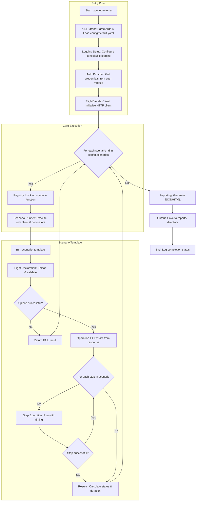

# Flow Diagram

```mermaid
graph TD
    subgraph "Entry Point"
        A[Start: openutm-verify] --> B[CLI Parser: Parse Args & Load config/default.yaml];
        B --> C[Logging Setup: Configure console/file logging];
        C --> D[Auth Provider: Get credentials from auth module];
        D --> E[FlightBlenderClient: Initialize HTTP client];
    end

    subgraph "Core Execution"
        E --> F{For each scenario_id in config.scenarios};
        F -- Yes --> G[Registry: Look up scenario function];
        G --> H[Scenario Runner: Execute with client & decorators];
    end

    subgraph "Scenario Template"
        H --> I[run_scenario_template];
        I --> J[Flight Declaration: Upload & validate];
        J --> K{Upload successful?};
        K -- No --> L[Return FAIL result];
        K -- Yes --> M[Operation ID: Extract from response];
        M --> N{For each step in scenario};
        N -- Yes --> O[Step Execution: Run with timing];
        O --> P{Step successful?};
        P -- No --> Q[Break & aggregate results];
        P -- Yes --> N;
        N -- No --> Q[Results: Calculate status & duration];
    end

    Q --> F;
    F -- No --> R[Reporting: Generate JSON/HTML];
    R --> S[Output: Save to reports/ directory];
    S --> T[End: Log completion status];

    L --> F;
```
