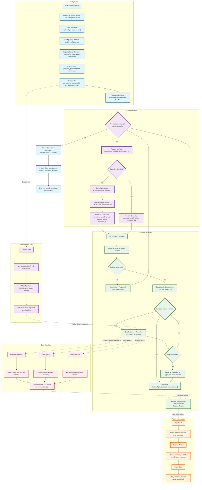

# Flow Diagram

```mermaid
graph TD
    %% Define colors for different sections
    classDef entryPoint fill:#e1f5fe,stroke:#01579b,stroke-width:2px
    classDef coreExecution fill:#f3e5f5,stroke:#4a148c,stroke-width:2px
    classDef scenarioTemplate fill:#e8f5e8,stroke:#1b5e20,stroke-width:2px
    classDef errorHandling fill:#ffebee,stroke:#b71c1c,stroke-width:2px
    classDef resultAggregation fill:#fff3e0,stroke:#e65100,stroke-width:2px
    classDef authFlow fill:#f3e5f5,stroke:#6a1b9a,stroke-width:2px

    subgraph "Entry Point"
        A["Start: openutm-verify"] --> B["CLI Parser: Parse Args & Load config/default.yaml"];
        B --> C["Config Validation: AppConfig.model_validate()"];
        C --> D["ConfigProxy: Initialize global config access"];
        D --> E["Logging Setup: Configure console/file logging with timestamps"];
        E --> F["Auth Provider: get_auth_provider() from auth module"];
        F --> G["Credentials: get_cached_credentials() with audience/scopes"];
        G --> H["FlightBlenderClient: Initialize HTTP client with OAuth2"];
    end

    subgraph "Core Execution"
        H --> I{"For each scenario_id in config.scenarios"};
        I -- Yes --> J["Registry Lookup: SCENARIO_REGISTRY[scenario_id]"];
        J --> K{"OpenSky Required?"};
        K -- Yes --> L["OpenSky Settings: create_opensky_settings()"];
        L --> M["OpenSky Client: Initialize OAuth2-authenticated client"];
        M --> N["Scenario Execution: scenario_func(fb_client, opensky_client, scenario_id)"];
        K -- No --> O["Scenario Execution: scenario_func(fb_client, scenario_id)"];
    end

    subgraph "Scenario Template"
        N --> P["run_scenario_template"];
        O --> P;
        P --> Q["Flight Declaration: Upload & validate"];
        Q --> R{"Upload successful?"};
        R -- No --> S["Early Return: FAIL result with error details"];
        R -- Yes --> T["Operation ID: Extract from response.details['id']"];
        T --> U{"For each step in scenario"};
        U -- Yes --> V["Step Execution: Run with @scenario_step timing"];
        V --> W{"Step successful?"};
        W -- No --> X["Break: Stop execution, aggregate partial results"];
        W -- Yes --> U;
        U -- No --> Y["Teardown: delete_flight_declaration(operation_id)"];
        Y --> Z["Results: Aggregate all StepResults into ScenarioResult"];
    end

    Z --> I;
    I -- No --> AA["Report Generation: Generate JSON/HTML/LOG reports"];
    AA --> BB["Output: Save timestamped reports to reports/ directory"];
    BB --> CC["End: Log completion status with summary"];

    S --> I;
    X --> Y;

    subgraph "Error Handling"
        DD["FlightBlenderError"] --> EE["Custom exception with API details"];
        FF["OpenSkyError"] --> GG["OAuth2/network error handling"];
        HH["ValidationError"] --> II["Pydantic model validation failures"];
        EE --> JJ["StepResult with FAIL status & error_message"];
        GG --> JJ;
        II --> JJ;
    end

    subgraph "Result Aggregation"
        KK["StepResult"] --> LL["status, duration, details, error_message"];
        LL --> MM["ScenarioResult"] --> NN["status, duration_seconds, steps[], error_message"];
        NN --> OO["ReportData"] --> PP["total_scenarios, passed, failed, scenarios[]"];
    end

    subgraph "Authentication Flow"
        QQ["OAuth2Client"] --> RR["get_access_token() with auto-refresh"];
        RR --> SS["Token Injection: Authorization: Bearer {token}"];
        SS --> TT["HTTP Requests: httpx with auth headers"];
    end

    %% Connect disconnected subgraphs to main flow
    V -.->|Error during step execution| DD;
    V -.->|OpenSky error| FF;
    V -.->|Validation error| HH;
    JJ -.->|Failed step result| Z;
    TT -.->|Authenticated requests| V;

    G -.->|OAuth2 flow| QQ;

    Z -.->|Aggregate results| KK;

    %% Apply colors to subgraphs
    class A,B,C,D,E,F,G,H entryPoint;
    class I,J,K,L,M,N,O coreExecution;
    class P,Q,R,S,T,U,V,W,X,Y,Z scenarioTemplate;
    class DD,EE,FF,GG,HH,II,JJ errorHandling;
    class KK,LL,MM,NN,OO,PP resultAggregation;
    class QQ,RR,SS,TT authFlow;

    %% Apply colors to remaining nodes
    class AA,BB,CC entryPoint;
```
