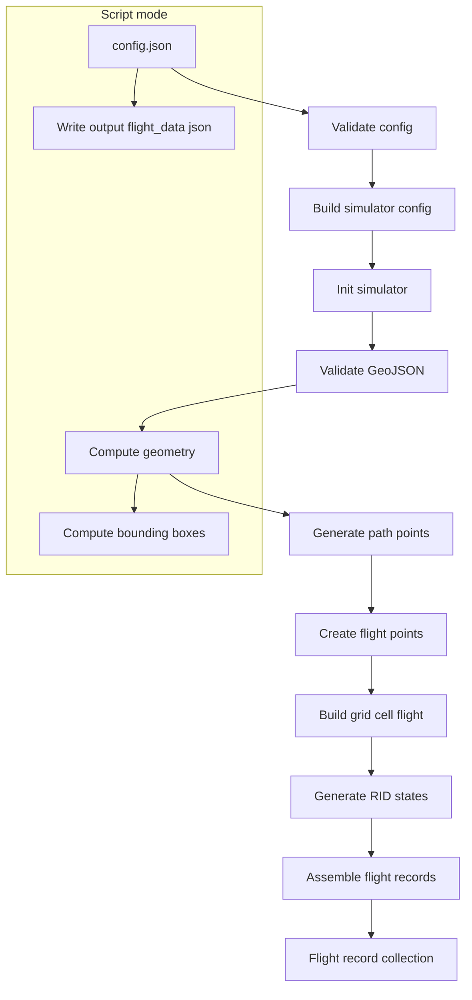

# GeoJSON Flight Simulator

This simulator generates ASTM F3411 RID aircraft states from a validated GeoJSON LineString. It pre-validates and derives geometry from the input, converts it into time-stepped flight points (with speed and bearing), then emits RIDAircraftState sequences and wraps them into FullFlightRecord objects.

## What it does

- Validates the input FeatureCollection and extracts a LineString path
- Computes derived geometry (bounds, center, LineString length, full and half bounding boxes)
- Generates one flight track sampled at 1 Hz with per-segment speed and bearing
- Produces RIDAircraftState objects for a requested duration
- Assembles FullFlightRecord(s) with operator/flight details
- Optionally writes first flight record to `output/flight_data.json` when run as a script

## Inputs

- GeoJSON FeatureCollection containing a single LineString
- Reference time (UTC) for timestamping
- Altitude parameters (AGL and ground reference altitude)
- Optional random seed and UTM zone

## Outputs

- In-memory: `FlightRecordCollection` with one or more `FullFlightRecord` entries
- Script mode: `output/flight_data.json` (first flight only), plus computed bounding boxes in-memory

## Workflow (Mermaid)

## Key classes and functions

- `GeoJSONFlightsSimulator` (core):
  - `__init__`: validates GeoJSON via `ValidatedFlightPath`, precomputes geometry (LineString, bounds, center, boxes)
  - `generate_flight_grid_and_path_points(altitude)`: builds per-point speed/bearing and wraps them in a `GridCellFlight`
  - `generate_rid_state(duration)`: emits 1 Hz `RIDAircraftState` series and assembles `FullFlightRecord`
- `generate_aircraft_states(config)`: convenience function that returns a `FlightRecordCollection`

## Usage

Programmatic (recommended):

- Construct a `GeoJSONFlightsSimulatorConfiguration` from your validated GeoJSON
- Call `generate_aircraft_states(config)` to receive a `FlightRecordCollection`

Script mode (`python geo_json_flight_simulator.py`):

- Reads `config.json` from the current directory
- Writes `output/flight_data.json` containing the first flight only

## Notes

- Speed is computed from geodesic distance between adjacent points at 1-second intervals
- Bearing is normalized to [0, 360)
- Operator/flight details are synthetic and generated deterministically when a `random_seed` is provided
- Bounding boxes (`box`, `half_box`) are computed but only used in-memory by default
